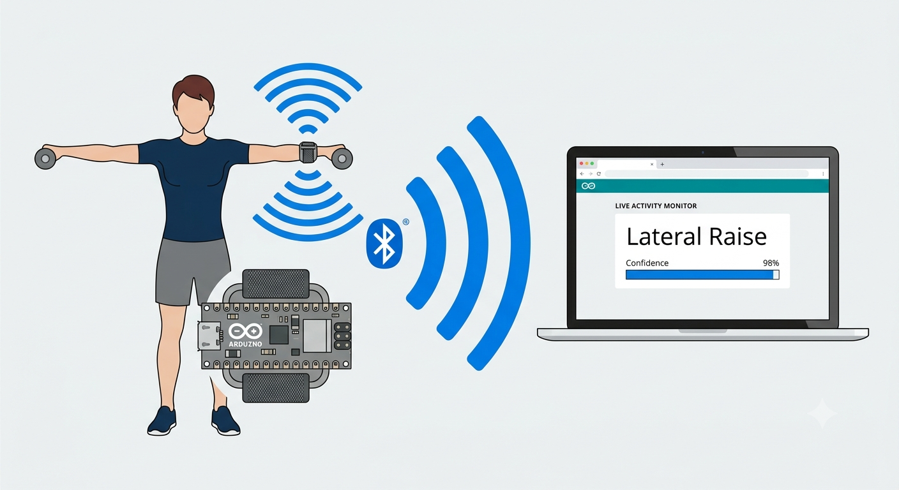

# human-activity-recognition

Final year project — an end-to-end pipeline to classify 6 physical activities in real-time from wrist accelerometer data. Trained and compared CNN, LSTM, and MLP models, quantized the best to INT8 using TensorFlow Lite for on-device inference on an Arduino, streaming predictions via Bluetooth to a web browser.

**Supported Activities:**

- Star Jumping  
- Shoulder Front Rotations  
- Lateral Raises  
- Shoulder External Rotations  
- Shoulder Internal Rotations  
- Standing

## How it works



```
Wrist (Arduino Nano 33 BLE Sense)              Python (offline)
┌──────────────────────────────┐            ┌────────────────────────┐
│  LSM9DS1 accelerometer       │───CSV─────▶│  Train CNN/LSTM/MLP    │
│  collect_data.ino            │            │  Quantize best → INT8  │
└──────────────────────────────┘            │  Export → model.h      │
                                            └──────────┬─────────────┘
                                                       │ flash
                                                       ▼
┌──────────────────────────────┐            ┌────────────────────────┐
│  Web browser                 │◀───BLE─────│  run_model.ino         │
│  Live activity display       │            │  75-sample window      │
└──────────────────────────────┘            │  INT8 inference        │
                                            └────────────────────────┘
```

The Arduino captures a 75-sample accelerometer window (~0.6 s), runs INT8 inference on-device using TensorFlow Lite for Microcontrollers, and transmits the predicted activity class over Bluetooth Low Energy to a web browser.
